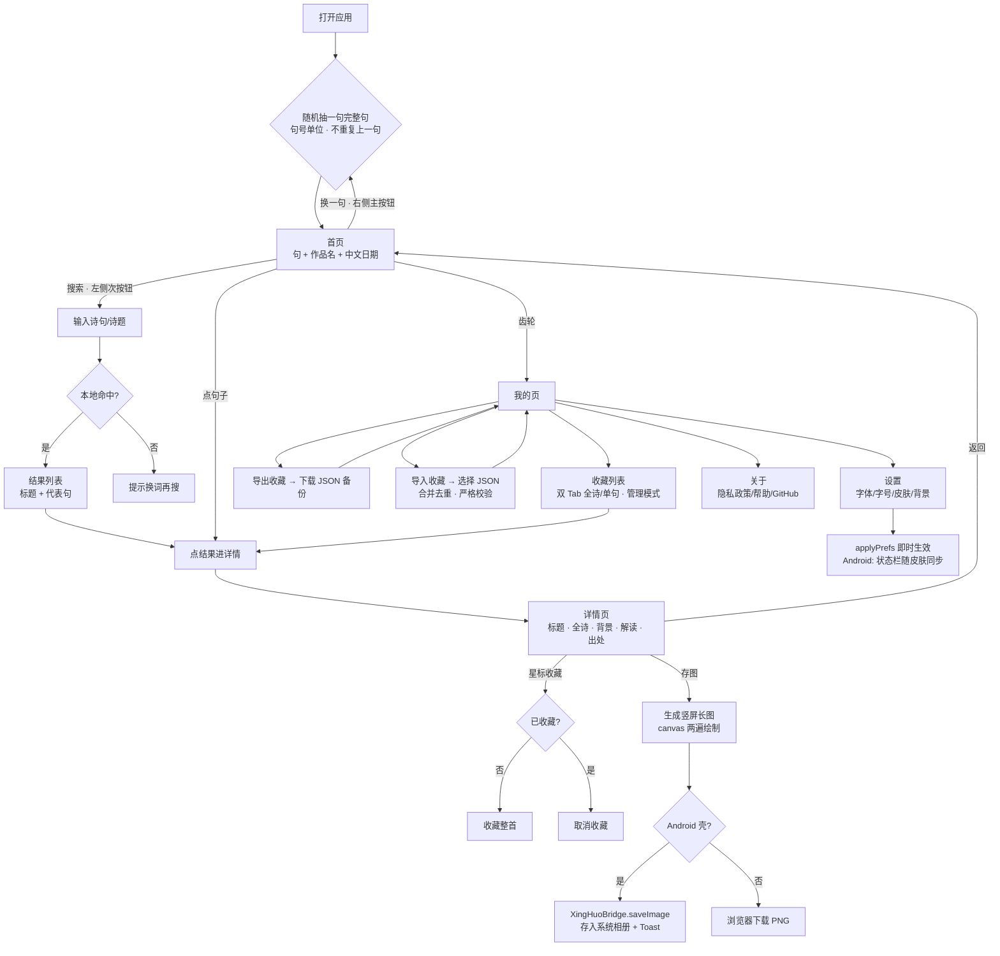
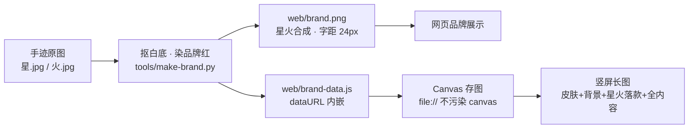
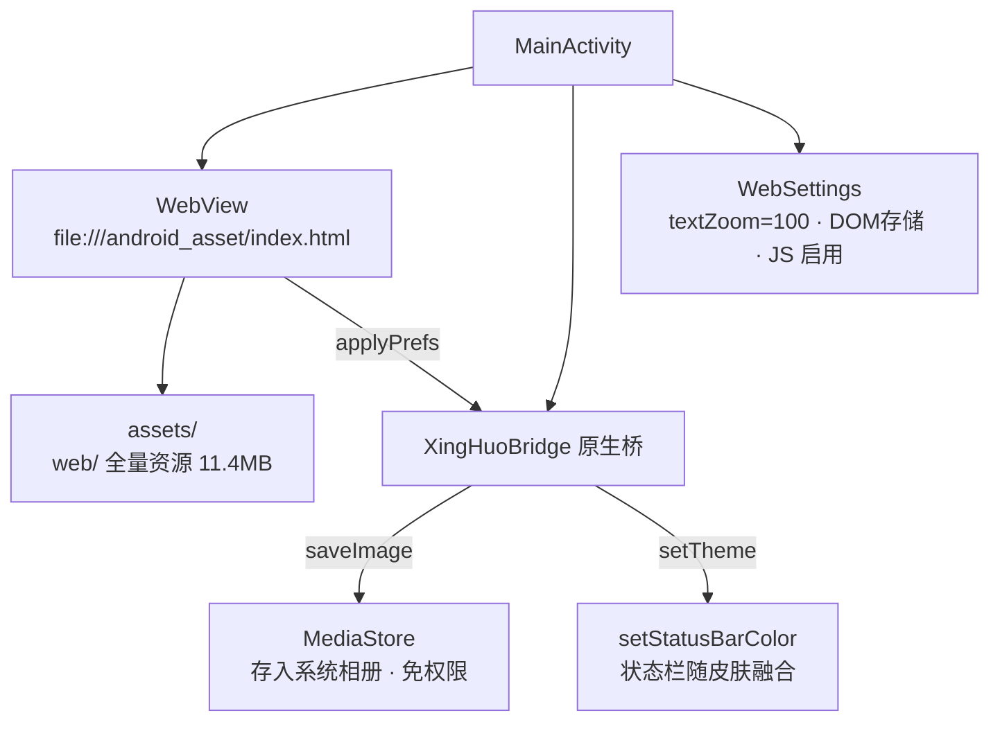
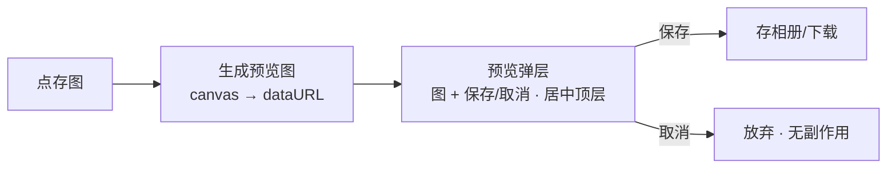
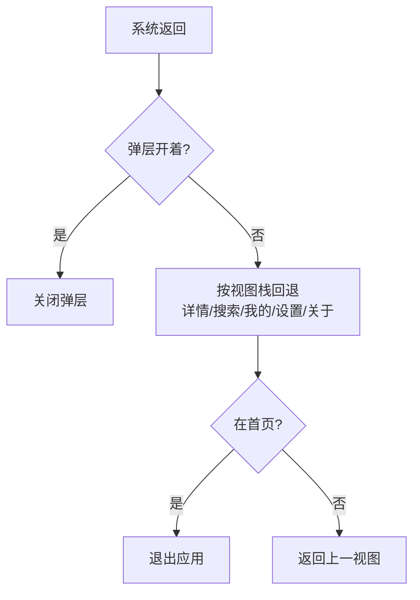

# 星火 · 产品流程图 v1.0

> mermaid 语法，可粘贴到 https://mermaid.live 渲染，或照着画进 Visio/ProcessOn。
> 版本对齐：PRD v1.0（一期全量交付，2026-08-30）。

## 1. 用户主流程（App / 网页内）

## 2. 内容生产流程（编辑侧，不进 App）

```mermaid
flowchart LR
    A[三本 EPUB 解压<br/>年谱全九卷/传记/鉴赏] --> B[解析器<br/>tools/build-material.py]
    B --> C[素材库<br/>年谱条目 + 传记章节 + 鉴赏索引]
    C --> D[材料包装配<br/>按诗写作时间取同期材料]
    D --> E[AI 起草背景+解读<br/>约束：只用包内材料<br/>禁「年谱记载」字样 · 禁现编 · 缺料标注]
    E --> F[人工审稿<br/>查事实 / 禁鸡汤 / 禁出处字眼 / 后见之明独立段]
    F --> G[content/poems/&lt;id&gt;.json × 63<br/>字段级校验]
    G --> H[tools/kb.py 构建<br/>全量校验：字段完整 / 行句完整]
    H --> I[web/data/poems.js<br/>← 唯一进用户包的成品数据]
    I --> J[网页 / APK 打包<br/>make-brand.py 同步品牌 dataURL]
```

## 3. 品牌与存图管线

## 4. Android 壳架构

## 5. 关键决策点（面试可讲）

1. **随机还是按顺序**：随机——每个句子都有机会被看见；防重复（不连续同诗同句）
2. **换一句在右**：右利手拇指热区，主行动最易触达（48px 不缩）
3. **返回保持原句**：详情/搜索/设置返回首页不换句——「回来看刚才那句」
4. **皮肤 = 整套配色**：不做独立字体颜色功能（职责重叠，冲突无从裁决）
5. **整句一行 + 15px**：七绝七律不提前换行；词长短句自然错落；字号与主流阅读 App 一致
6. **存图竖屏长图**：手机分享载体是竖屏；皮肤/背景/手迹品牌全入图
7. **品牌 dataURL 内嵌**：file:// 下 canvas 污染 → toBlob 报错；dataURL 双端安全
8. **导出/导入严格校验**：id 在库 / 整数索引 / kind 语义 / 时间合法——坏文件不破坏收藏
9. **textZoom 固定 100**：WebView 跟随系统字体大小会放大字号——固定后与设计稿一致
10. **状态栏融合**：卡片背景色蔓延到系统状态栏，深色皮肤自动白字图标

## 6. 已落地流程（v1.1）

- **存图 / 导出 / 导入二次确认**（已实现）：存图先生成预览图（弹层居中展示），用户确认后再保存；导出/导入确认含明细——涉及存储的操作均有反悔机会：

- **Android 返回手势**（已实现）：返回键/左划手势 → 页面按视图栈回退（详情→来源、设置/我的/关于→上一级、首页→退出）；弹层开着时先关弹层：

## 7. 待改进流程（V2）

- 首页存图（截图式，无底部按钮，复用预览确认）
- 背景图上传提供截取区域（自由裁切）
- 检查更新（「关于」页手动触发，GitHub Releases）
