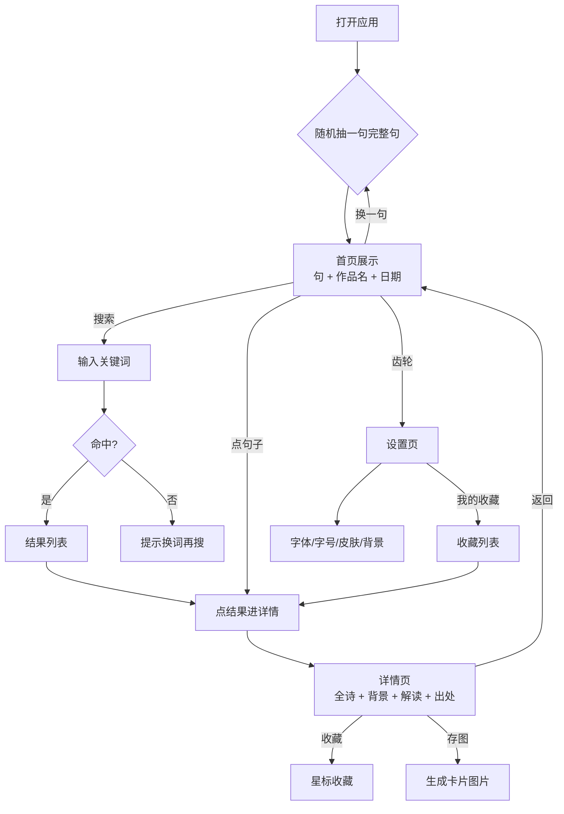
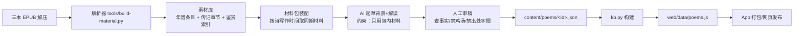

# 星火 · 产品流程图

> mermaid 语法，可粘贴到 https://mermaid.live 渲染，或照着画进 Visio/ProcessOn。

## 1. 用户主流程（App 内）

## 2. 内容生产流程（编辑侧，不进 App）

## 3. 用户主流程的决策点（面试可讲）

1. **随机还是按顺序**：随机——每个句子都有机会被看见；防重复（不连续同诗同句）
2. **换一句在右**：右利手拇指热区，主行动最易触达
3. **返回保持原句**：详情/搜索/设置返回首页不换句——用户的心理模型是「回来看刚才那句」
4. **皮肤 = 整套配色**：不做独立字体颜色功能（职责重叠，冲突无从裁决）
